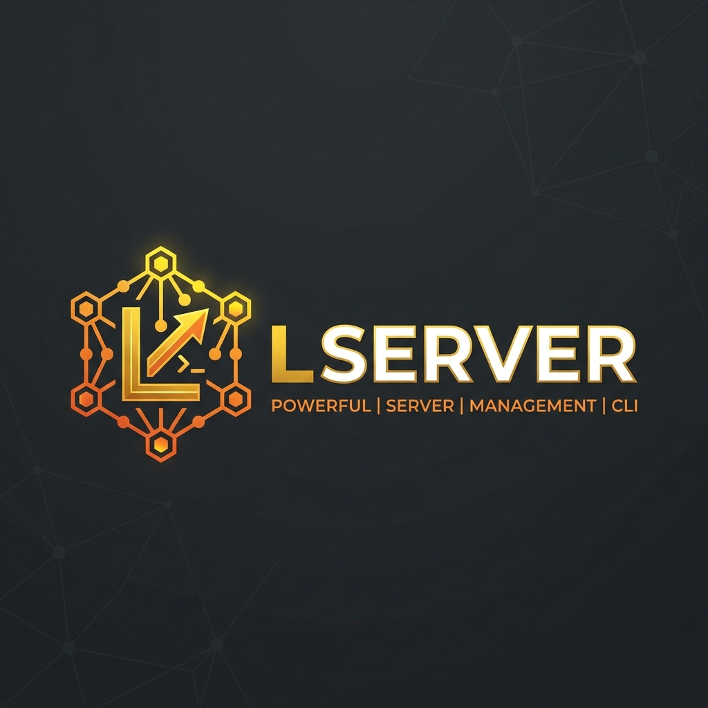

<p align="center">
  
</p>

<h1 align="center">⚡ LServer CLI - Ultimate Server Management ⚡</h1>

<p align="center">
  <strong>El poder absoluto de tus servidores en la palma de tu terminal.</strong><br>
  Domina, administra y mantén online tus nodos 24/7 sin dolores de cabeza. Diseñado con calidad Premium por <em>SrxMateo & Lumax Studio</em>.
</p>

---

## 🚀 ¿Qué es LServer CLI?

Se acabó el tener que buscar procesos huérfanos, perder tiempo con configuraciones complejas o escribir comandos largos y tediosos. **LServer CLI** es una herramienta de élite desarrollada para dueños de servidores y administradores de sistemas que exigen **velocidad, estabilidad y control absoluto**.

Con **LServer**, puedes encender, apagar, visualizar y administrar múltiples "nodos" (instancias de servidores o aplicaciones) con una interfaz de terminal increíblemente elegante, impulsada por tecnología de monitoreo en tiempo real.

### 🔥 Características Principales

*   **Motor SQLite Asíncrono**: Transacciones seguras (ACID) mediante patrón Singleton. Adiós a la corrupción de archivos JSON; LServer maneja miles de operaciones de nodos con fiabilidad militar.
*   **Vigilante Inteligente (Daemon)**: Un proceso fantasma en segundo plano de 0% CPU que vigila tus servidores. 
    *   **Auto-Heal (❤)**: Si tu servidor crashea por falta de RAM o errores, el vigilante lo resucita automáticamente.
    *   **Auto-Backups (💾)**: Copias de seguridad automáticas a las 03:00 AM, aislando tus datos en archivos `.tar.gz` ultra-comprimidos.
*   **Seguridad Zero-Trust**: Inyección de comandos, Path Traversal y ataques por Regex completamente bloqueados mediante sanitizadores estrictos y consultas SQL preparadas.
*   **Estadísticas Nativas en Vivo**: Observa el consumo de CPU, RAM y Disco duro directamente en el hermoso Dashboard dorado.
*   **Diseño de Terminal Premium**: Despídete de los textos blancos y aburridos. LServer utiliza una paleta de colores térmicos, iconografía (❤/💾) y ASCII interactivo que eleva la experiencia de usuario.

---

## ⚡ Instalación Mágica en 1 Clic (Recomendado)

No pierdas tiempo con instalaciones manuales. Hemos preparado un script de autoconfiguración para sistemas Linux modernos (Ubuntu, Debian, CentOS, etc.).

Abre tu consola y pega este único comando:

```bash
curl -sL https://raw.githubusercontent.com/SrxMateo/LServer/main/install.sh | bash
```

¡Eso es todo! El instalador se encargará de clonar el código, instalar las dependencias necesarias y dejar el comando global `lserver` listo para la acción.

---

## 🛠️ Panel de Control y Comandos

Para ver tu centro de comando, simplemente escribe:

```bash
lserver
```

Te encontrarás con un Panel de Control majestuoso y una lista completa de opciones. Aquí tienes el arsenal completo a tu disposición:

| Comando | Descripción |
| :--- | :--- |
| `lserver -p <nodo>` | **Encender (Power)**: Arranca el servidor de inmediato y lo mantiene 24/7. |
| `lserver -d <nodo>` | **Detener**: Envía la orden de apagado seguro al nodo para no perder datos. |
| `lserver -k <nodo>` | **Kill (Forzado)**: Destruye el proceso al instante. Ideal para nodos congelados. |
| `lserver -c <nodo>` | **Crear**: Levanta un nodo nuevo (prepara la carpeta y su configuración). |
| `lserver -x <nodo>` | **Borrar**: Elimina el nodo y limpia completamente su directorio del sistema. |
| `lserver -a <nodo>` | **Auto-Heal**: Activa/Desactiva el resucitador automático del Daemon (❤). |
| `lserver -b <nodo>` | **Backups**: Menú interactivo para crear respaldos manuales o automáticos 24h (💾). |
| `lserver daemon start` | **Iniciar Vigilante**: Activa el motor de LServer en background. |
| `lserver daemon stop` | **Detener Vigilante**: Apaga los servicios de monitoreo. |
| `lserver -l` | **Listar**: Carga el Dashboard y la tabla de todos tus servidores creados. |
| `lserver -e <nodo>` | **Entrar**: Ingresa a la consola en vivo del servidor. *(Usa `Ctrl+A, D` para salir)* |
| `lserver -v` | **Versión**: Imprime la versión actual de la herramienta instalada. |

---

## 💡 Ejemplos de Uso

**1. Creando tu primer servidor de producción:**
```bash
lserver -c MiAppBackend
lserver -p MiAppBackend
```
*¡Listo! Tu aplicación estará corriendo en segundo plano protegida de cierres inesperados.*

**2. Revisando el estado de toda tu red:**
```bash
lserver
```
*Aparecerá el Dashboard informándote qué nodo está ONLINE y cuál está OFFLINE.*

---

## 🤝 Soporte y Comunidad

**LServer** es un proyecto nacido en los laboratorios de [Lumax Studio](#). Estamos constantemente creando soluciones vanguardistas para llevar el ecosistema de servidores al siguiente nivel.

*Si encuentras un error o tienes una idea brutal para mejorar la herramienta, no dudes en abrir un **Issue** o enviarnos un **Pull Request**.*

---
<p align="center">
  <small>© 2026 SrxMateo & Lumax Studio. Construido con pasión y precisión.</small>
</p>
