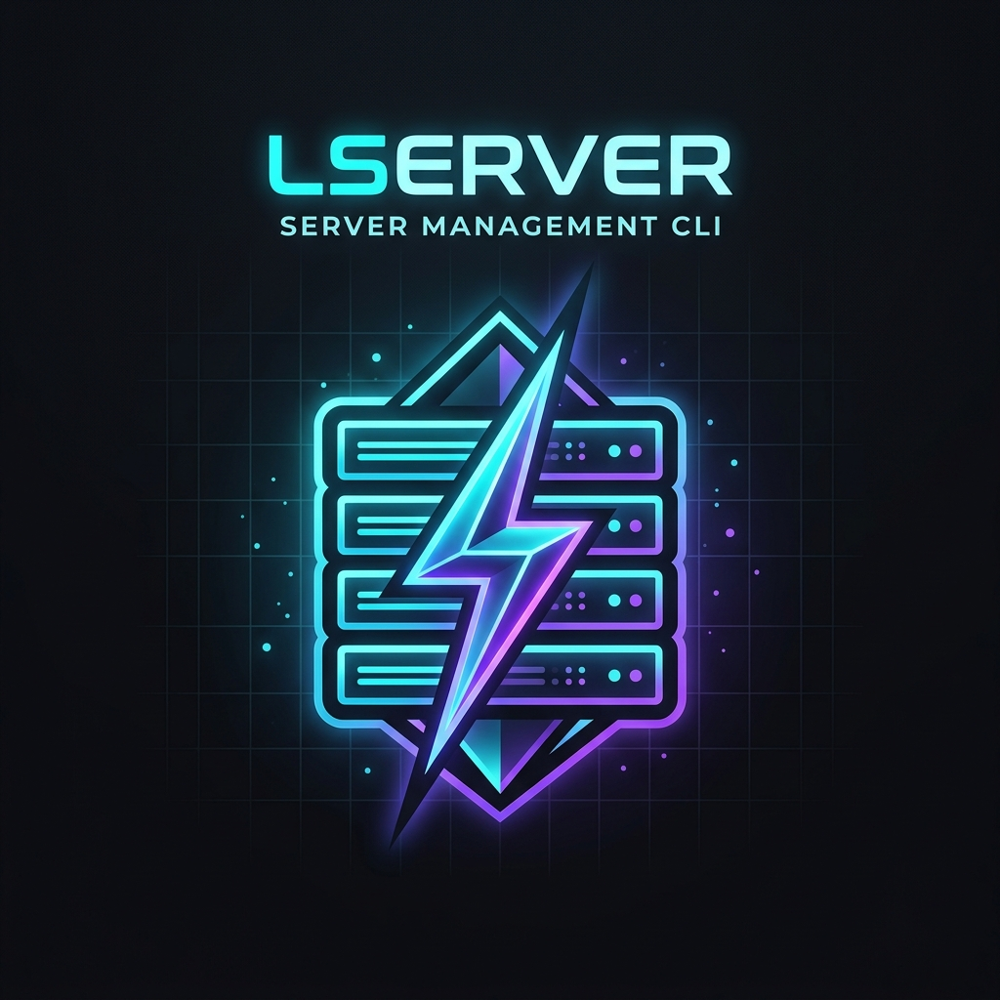

<div align="center">
  
  <br/>

  

  <p>
    <a href="https://lumax.lat"></a>
    
    
    
    
  </p>
</div>

<p align="center">
  
</p>

## 🚀 ¿Qué es LServer CLI?

Se acabó el tener que buscar procesos huérfanos, perder tiempo con configuraciones complejas o escribir comandos largos y tediosos. **LServer CLI** es una herramienta de élite desarrollada para dueños de servidores y administradores de sistemas que exigen **velocidad, estabilidad y control absoluto**.

Con **LServer**, puedes encender, apagar, visualizar y administrar múltiples "nodos" (instancias de servidores o aplicaciones) con una interfaz de terminal increíblemente elegante, impulsada por tecnología de monitoreo en tiempo real.

<br/>

## 🔥 Arquitectura & Características (V3.6)

<div align="center">
  <a href="https://skillicons.dev">
    
  </a>
</div>

*   **Motor SQLite Asíncrono**: Transacciones seguras (ACID) mediante patrón Singleton. Adiós a la corrupción de archivos JSON; LServer maneja miles de operaciones con fiabilidad militar.
*   **Vigilante Inteligente (Daemon)**: Un proceso fantasma en segundo plano de 0% CPU que vigila tus servidores. 
    *   **Auto-Heal (❤)**: Si tu servidor crashea por falta de RAM o errores, el vigilante lo resucita automáticamente.
    *   **Auto-Backups (💾)**: Copias de seguridad automáticas a las 03:00 AM, aislando tus datos en archivos `.tar.gz` ultra-comprimidos.
*   **Web Dashboard Privado**: Interfaz gráfica premium (Dark Mode & Glassmorphism) que corre bajo demanda para gestionar servidores con un clic desde el navegador.
*   **Plantillas Inteligentes (Templates)**: Crea nodos al instante con configuraciones pre-optimizadas para `minecraft`, `nodejs`, `python`, `react`, `nextjs`, `vite` y más.
*   **Gestión por Grupos**: Lanza o apaga clústeres completos de servidores al mismo tiempo (ej. `lserver -g Bungee -s`).
*   **Multi-Idioma Nativo**: Traducción completa al Español, Inglés, Portugués y Francés.
*   **Seguridad Zero-Trust**: Inyección de comandos y Path Traversal bloqueados mediante sanitizadores estrictos y consultas SQL preparadas.

<p align="center">
  
</p>

## ⚡ Instalación Mágica en 1 Clic (Premium Installer)

No pierdas tiempo con instalaciones manuales. Hemos preparado un script de autoconfiguración rápido, silencioso y visualmente atractivo.

Abre tu consola y pega este único comando:

```bash
curl -sL https://raw.githubusercontent.com/SrxMateo/LServer/main/install.sh | bash
```

¡Eso es todo! El instalador se encargará de clonar el código, instalar las dependencias necesarias sin arrojar basura a la consola y dejar el comando global `lserver` listo para la acción.

<p align="center">
  
</p>

## 🛠️ Panel de Control y Arsenal de Comandos

Para ver tu centro de comando, simplemente escribe `lserver`. Te encontrarás con un Panel de Control majestuoso.

| Comando | Descripción |
| :--- | :--- |
| `lserver -p <nodo>` | **Encender (Power)**: Arranca el servidor de inmediato y lo mantiene 24/7. |
| `lserver -d <nodo>` | **Detener**: Envía la orden de apagado seguro al nodo para no perder datos. |
| `lserver -k <nodo>` | **Kill (Forzado)**: Destruye el proceso al instante. Ideal para nodos congelados. |
| `lserver -c <nodo>` | **Crear**: Levanta un nodo nuevo (puedes usar `--template nextjs`). |
| `lserver -x <nodo>` | **Borrar**: Elimina el nodo y limpia completamente su directorio del sistema. |
| `lserver -a <nodo>` | **Auto-Heal**: Activa/Desactiva el resucitador automático del Daemon (❤). |
| `lserver -e <nodo>` | **Terminal en Vivo**: Ingresa a la consola interactiva de tu servidor. *(Usa `Ctrl+C` para salir)* |
| `lserver -g <grupo> -s`| **Arrancar Grupo**: Inicia todos los nodos pertenecientes a un grupo. |
| `lserver web start` | **Web Panel**: Despliega el Dashboard en tu IP pública para gestión gráfica. |
| `lserver -t` | **Idioma / Language**: Menú interactivo para cambiar el idioma del sistema. |
| `lserver -i` | **Wiki (Ayuda)**: Muestra el manual de usuario en la terminal. |
| `lserver daemon start` | **Iniciar Vigilante**: Activa el motor de LServer en background. |
| `lserver update` | **Actualizar (OTA)**: Descarga e instala la última versión de LServer. |

<p align="center">
  
</p>

## 💡 Ejemplos Rápidos de Producción

**1. Creando tu primer servidor de producción:**
```bash
lserver -c MiAppBackend --template nodejs
lserver -p MiAppBackend
```
*¡Listo! Tu aplicación estará corriendo en segundo plano protegida de cierres inesperados.*

**2. Cambiando el Idioma:**
```bash
lserver -t
```
*Abre el selector para elegir Español, Inglés, Portugués o Francés.*

**3. Revisando el estado de toda tu red:**
```bash
lserver
```
*Aparecerá el Dashboard informándote qué nodo está ONLINE y cuál está OFFLINE.*

<br/>

<div align="center">
  <h3>🤝 Desarrollo & Soporte</h3>
  <p><b>LServer</b> es un proyecto de código abierto forjado en los laboratorios de <b>Lumax Studio</b>.</p>
  <a href="https://lumax.lat"></a>
  <br/><br/>
  <p><small>© 2026 SrxMateo & Lumax Studio. Construido con pasión y precisión.</small></p>
</div>
